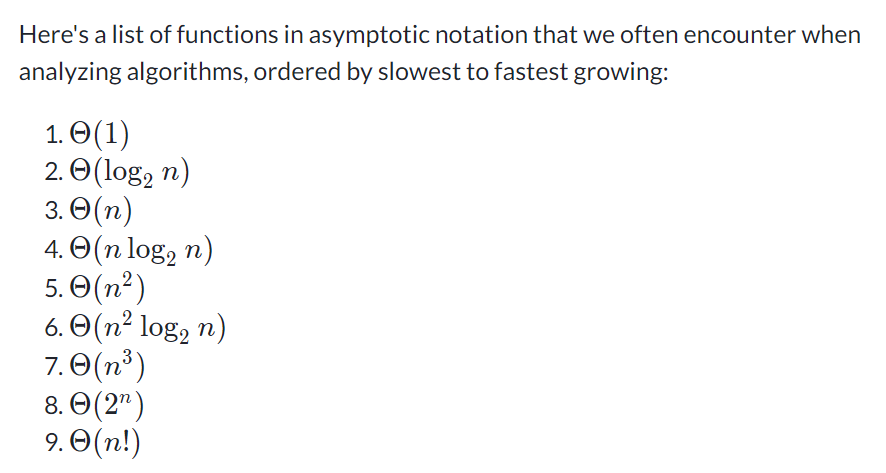

# Asymptotic notation
* running time of the algorithm as a function of the size of ts input
* = rate of growth: (when increase input size)
* drop the less significant terms
* drop the constant coefficients

### Big-Theta notation
* big-Theta of n: once n gets large enough, the running time is between k1 * f(n) and k2 * f(n)
* when we use big-Theta notation, we have an asymptotically tight bound on running time
  * asymptotically: b/c it matters for only large values of n
  * tight bound: b/c we've nailed the running time to within a constant factor above and below

### Functions in asymptotic notation
* constant running time is big-Theta(n(power)0), n(power)0 is 1, same as big-Theta(1)
* big-Theta(log(base10) n) is the same as big-Theta(log(base2) n)
  * if a,b are const, then log(base-a)n and log(base-b)n differ only by a factor of log(base-b)a
  * the const factor can be ignore in asymptotic notation
* worse-case running time of binary search is big-Theta(log(base-a)n
* if a < b, then running time of big-Theta(n(power)a) grows slower than big-Theta(n(power)b)
  * the exponents don't have to be integer: big-Theta(n(power)2) < big-Theta(n(power)2.5)
    * n(power)2.5 is same as n(power)2 * n(squareroot)

### Practice: Comparing function growth

### Big-O notation

### Big-Omega notation

### Practice: Asymptotic notation
