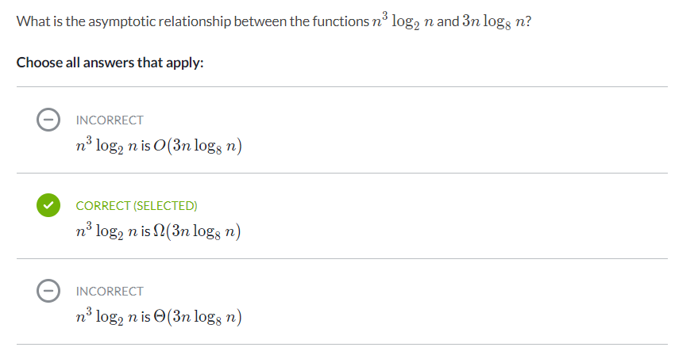

# Asymptotic notation
* running time of the algorithm as a function of the size of ts input
* = rate of growth: (when increase input size)
* drop the less significant terms
* drop the constant coefficients

### Big-Theta notation
* big-Theta of n: once n gets large enough, the running time is between k1 * f(n) and k2 * f(n)
* when we use big-Theta notation, we have an asymptotically tight bound on running time
  * asymptotically: b/c it matters for only large values of n
  * tight bound: b/c we've nailed the running time to within a constant factor above and below

### Functions in asymptotic notation
* constant running time is big-Theta(n(power)0), n(power)0 is 1, same as big-Theta(1)
* big-Theta(log(base10) n) is the same as big-Theta(log(base2) n)
  * if a,b are const, then log(base-a)n and log(base-b)n differ only by a factor of log(base-b)a
  * the const factor can be ignore in asymptotic notation
* worse-case running time of binary search is big-Theta(log(base-a)n
* if a < b, then running time of big-Theta(n(power)a) grows slower than big-Theta(n(power)b)
  * the exponents don't have to be integer: big-Theta(n(power)2) < big-Theta(n(power)2.5)
    * n(power)2.5 is same as n(power)2 * n(squareroot)

* note: exponential fn a(power)n, where a>1, grows faster than any polynomial fn n(power)b, where b is const

### Practice: Comparing function growth

* note: running time should be on y axis

### Big-O notation
* big-O of f(n): once n gets large enough, the running time is at MOST k * f(n) for some const k
* asymptotic upper bound:
  * bounds the growth of the running time from above for large enough input sizes

### Big-Omega notation
* big-Omega of f(n): n gets large, the running time is at LEAST k * f(n) for some const k
* asymptotic lower bound:
  * bounds the growth of the running time from below for large enough input sizes

### Practice: Asymptotic notation
* When we find two fn differ by a constant multiplier,
* then we can always find k to serve as upper bound (big-O) or lower bound (big-Omega)
  * hence we can find big-Theta
* question 1:
  * log(base-8)n is big-O of log(base-2)n
  * log(base-8)n is big-Omega of log(base-2)n
  * HENCE: log(base-8)n is big-Theta of log(base-2)n
* question 2: what are the relationship b/b 8(power)n and 4(power)n?
  * => 8(power)n is big-Omega of 4(power)n
* question 3: what are the asymptotic relationship b/w n(power)k and c(power)n?
  * => n(power)k is big-O of c(power)n
  * n(power)k is polynomial, c(power)n is exponential fn
  * polynomials always grow more slowly than exponentials
* question 4:
  
* question 5:
  
